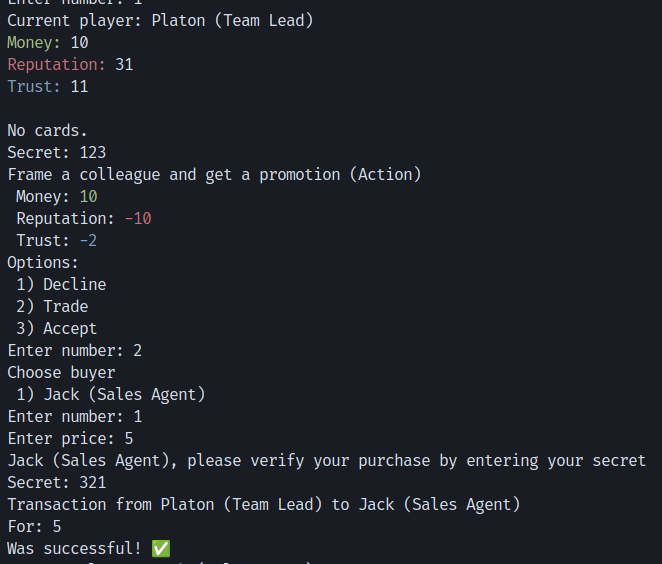
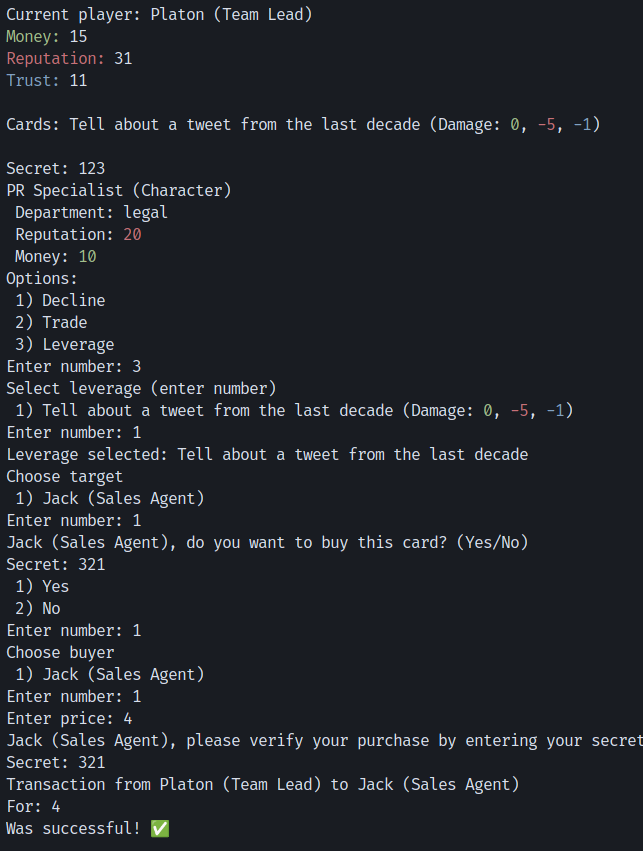

# Trading and Buyout System in the Game

## General Description

The trading and buyout system is an additional functionality that significantly expands the strategic possibilities for players. It allows players to interact with each other by exchanging cards for in-game currency.

## Base System Without Trading

In the base version of the game without the trading system:
1. Players can only use cards they receive during their turn
2. Have no ability to transfer cards to other players
3. If a card doesn't suit a player (e.g., a character from a different department), it can only be declined
4. No mechanism for buying out leverage cards

## Added Functionality

### 1. Card Trading System

#### Character Card Trading
- Players can sell character cards to other players
- Price is determined by agreement between players
- The buyer must be from the same department as the character
- Upon successful transaction:
  - Buyer loses the specified amount of money
  - Seller gains the specified amount of money
  - Card transfers to the buyer and is applied to them

#### Action Card Trading
- Any action cards can be sold
- Price is determined by agreement between players
- Upon successful transaction:
  - Buyer loses the specified amount of money
  - Seller gains the specified amount of money
  - Card effect is applied to the buyer

### 2. Leverage Card Buyout System

#### Buyout Mechanism
- When a player uses a leverage card against another player
- The target player can offer to buy out the card
- If the card owner agrees to the buyout:
  - The leverage card is deactivated
  - Money transfers from the target player to the card owner
  - The card effect is not applied

#### Special Conditions
- Buyout is only possible if the card hasn't been used yet
- Buyout price is determined by agreement between players outside of game behavior, the game is responsible for transaction confirmation

## Interaction Examples

### Example 1: Action Card Trading

### Example 2: Leverage Card Buyout

## Conclusion
The trading and buyout system adds a new level of strategic depth, allowing players to:
- Benefit from cards that don't suit them
- Protect themselves from negative leverage card effects
- Manage their resources more flexibly 